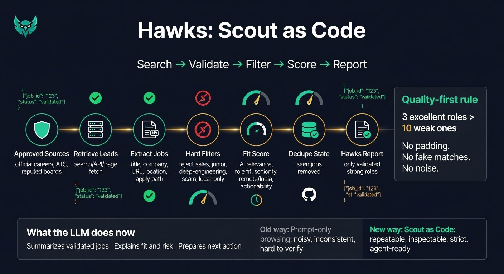

# Hawks Job Hunter


Hawks Job Hunter is an autonomous job-scouting project.



This initial public version starts with **Scout as Code**: a programmable pipeline that turns job discovery into repeatable retrieval, validation, filtering, scoring, deduplication, and structured JSON output.

## Scout as Code init

```bash
python3 scout_as_code.py --session manual --max-output 3 --max-leads 10 --per-query 1 --pretty
```

The default principle is simple:

> Fewer strong matches are better than many weak matches.

## Status

Initial public repo seed. Scout-as-Code only.
